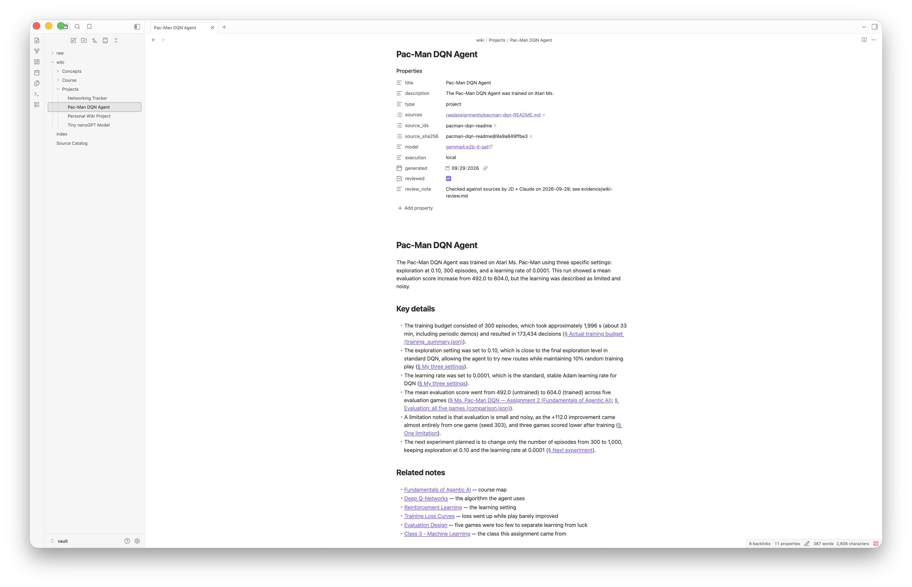
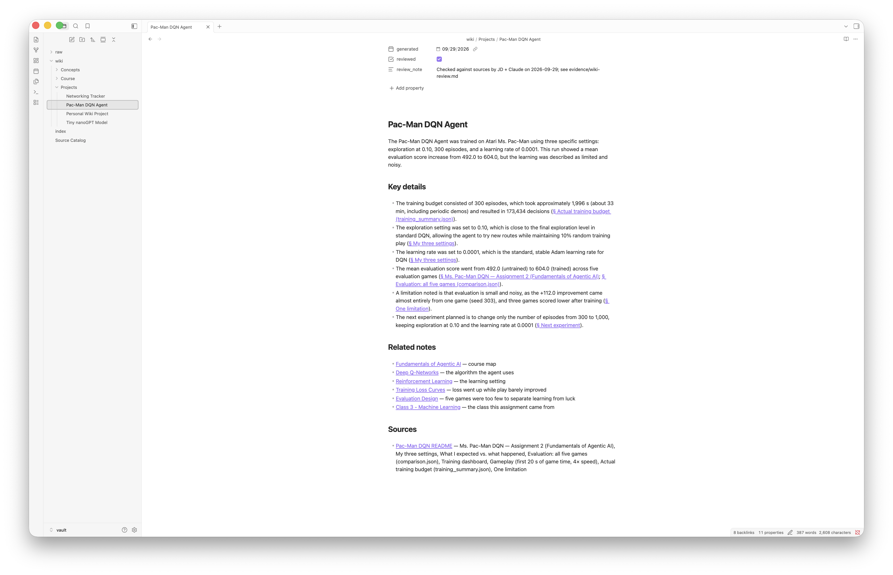
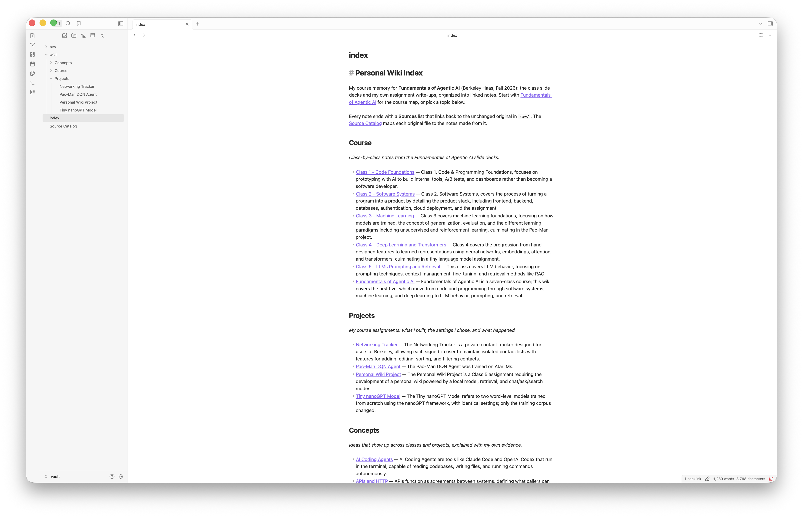
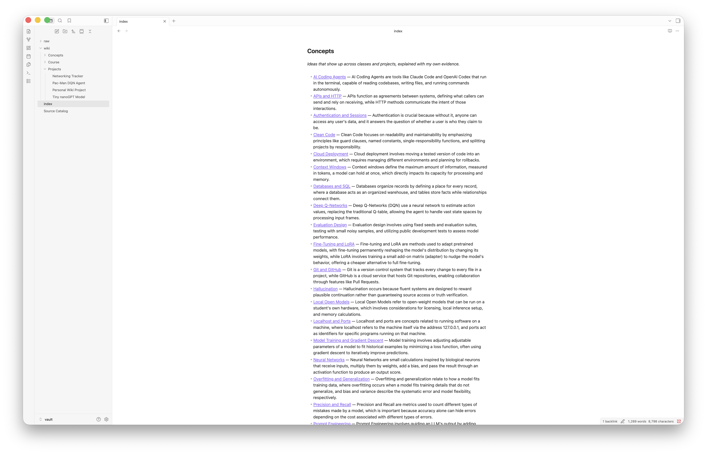
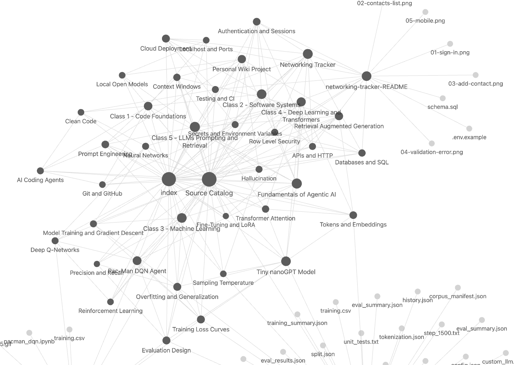
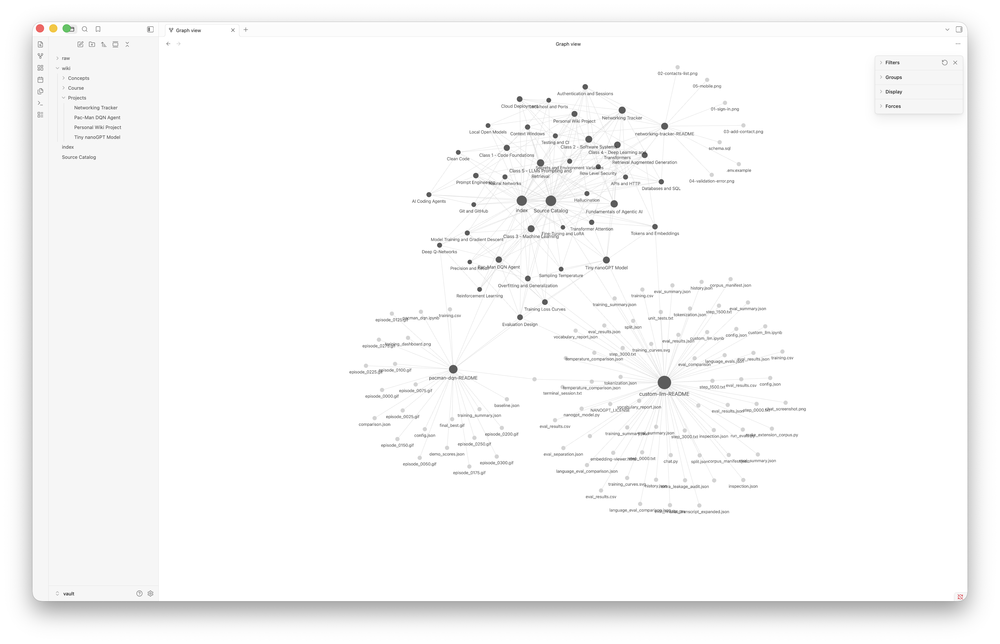
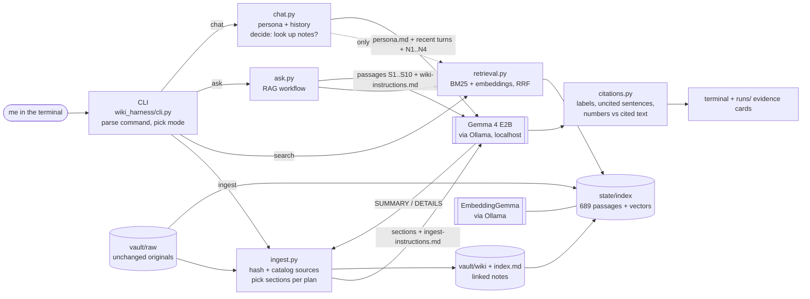
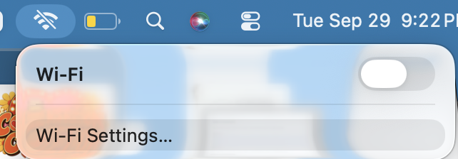

# Personal Wiki with Local Gemma + RAG

**JD Nathanson · Fundamentals of Agentic AI · Berkeley Haas, Fall 2026 · Class 5 assignment**

A personal wiki of my course: the Class 1–5 slide decks plus my own assignment write-ups, turned into 38 linked Obsidian notes. It comes with my own command-line harness, `./wiki`, which talks to that memory through a **local Gemma 4 E2B model running offline** on my 2019 Intel MacBook Pro. It has three modes:

- **`chat`**: “Margin”, a study-partner persona with conversation memory. It looks at my notes only when a message needs them.
- **`ask`**: neutral, standalone, cited answers from the original sources, or `INSUFFICIENT EVIDENCE`.
- **`search`**: the retrieval tool on its own. It returns original passages with their paths and generates nothing.

| Result | |
|---|---|
| Ask tests (offline) | **4 / 4 passed**: 3 answerable questions answered with correct citations, 1 unanswerable question answered `INSUFFICIENT EVIDENCE`. [Evidence →](evidence/ask-tests.md) |
| Mode checks (offline) | Chat capabilities without lookup ✅, follow-up “make that shorter” ✅, search without generation ✅, ask ignores chat claims ✅, chat fails to correct my false claim ⚠️ [Evidence →](evidence/mode-checks.md) |
| Offline proof | Wi-Fi off (`Wi-Fi Power (en0): Off`, `ping: cannot resolve github.com`), Ollama restarted, every record stamped `internet: offline`. [Transcript →](evidence/offline/offline-demo-20260929-212330.txt) |
| Wiki | 38 notes in 3 topic folders, grouped [index](vault/index.md), [source catalog](vault/Source%20Catalog.md), 0 broken links. Every Gemma draft reviewed; [11 corrections logged](evidence/wiki-review.md). |
| Speed / memory | ~47 s per cited answer, ~55 s per generated note; Gemma holds 4.0 GB in memory (CPU only). [Details ↓](#device-model-and-measurements) |

---

## Contents

1. [What the wiki is for, and the sources](#1-what-the-wiki-is-for-and-the-sources)
2. [Obsidian screenshots](#2-obsidian-screenshots)
3. [Device, model, and measurements](#device-model-and-measurements)
4. [Setup and exact commands](#4-setup-and-exact-commands)
5. [Architecture: how my data reaches the model](#5-architecture-how-my-data-reaches-the-model)
6. [Design choices](#6-design-choices)
7. [Evidence](#7-evidence)
8. [Reflection: one limitation and one improvement](#8-reflection-one-limitation-and-one-improvement)
9. [Repository map](#9-repository-map)

---

## 1. What the wiki is for, and the sources

**Purpose:** a course memory I can study from and question. What did each class cover? What did I actually do and find in each assignment? How do the concepts connect? It answers from my own material and says so when the material doesn't contain the answer.

| Source (unchanged original in `vault/raw/`) | What it is | In this public repo? |
|---|---|---|
| [`assignments/networking-tracker-README.md`](vault/raw/assignments/networking-tracker-README.md) | My Assignment 1 write-up: full-stack contact tracker, Neon Postgres RLS, Vercel | ✅ my own work |
| [`assignments/pacman-dqn-README.md`](vault/raw/assignments/pacman-dqn-README.md) | My Assignment 2 write-up: Ms. Pac-Man DQN run and evaluation | ✅ my own work |
| [`assignments/custom-llm-README.md`](vault/raw/assignments/custom-llm-README.md) | My Class 4 write-up: two tiny nanoGPT models and the 48-case evals | ✅ my own work |
| `course-slides/haas-class1.html` … `haas-class5.html` | The instructor's Class 1–5 decks, saved byte-for-byte from the [course site](https://haas-ai-classes-fall-26.vercel.app/) | ❌ **local only** (`.gitignore`), because they are the instructor's material. Notes link to the public slide URLs instead. |

The originals are never edited. Each file's SHA-256 is recorded in the [Source Catalog](vault/Source%20Catalog.md) (machine copy: [`state/catalog.json`](state/catalog.json)), which maps every source id and original filename to the readable notes made from it. Every note ends with a **Sources** list that links back to the exact README section, or to the exact public slide (e.g. `class1.html#/what-is-git`).

---

## 2. Obsidian screenshots

The vault is the `vault/` folder only (not the repo). All screenshots were taken in Obsidian on my Mac on 2026-09-29.

**(1) An open note with source references:** [Pac-Man DQN Agent](vault/wiki/Projects/Pac-Man%20DQN%20Agent.md). The short filename matches the heading. Properties hold the machine ids (source id, SHA-256 prefix, model, `reviewed`). Every detail ends with a clickable **§ section** link into the original README, and the note ends with Related notes and Sources.




**(2) The page list and the topic-organized index:** the sidebar shows `wiki/` with the Course / Projects / Concepts folders. [index.md](vault/index.md) groups every note by topic with a one-line description. *(Taken before one small fix: the Pac-Man line then ended at “…Atari Ms.” because my description code treated “Ms.” as a sentence end. The index is now regenerated and reads correctly; see [vault/index.md](vault/index.md).)*




**(3) Graph view.** Honest note: this is the graph **without** the `path:wiki/` filter. The dark nodes are my 38 notes plus `index` and `Source Catalog`. The two large clusters of pale nodes are the raw READMEs and the image/JSON files they link to in their original repos, which don't exist in the vault (Obsidian draws them as unresolved links). The close-up shows the readable labels and the “Related notes” connections: each class links to its concepts and its assignment, and projects link to the concepts they used.

| Close-up of the note cluster | Full graph (unfiltered) |
|---|---|
|  |  |

To reproduce the filtered view: Graph view → Filters → search `path:wiki/`, turn on *Existing files only*.

**Trace one note:** start at [index](vault/index.md), open [Pac-Man DQN Agent](vault/wiki/Projects/Pac-Man%20DQN%20Agent.md), follow “Related notes” to [Deep Q-Networks](vault/wiki/Concepts/Deep%20Q-Networks.md), then open its Sources link § *How the agent works, in plain language* in [the original README](vault/raw/assignments/pacman-dqn-README.md).

---

<a id="device-model-and-measurements"></a>
## 3. Device, model, and measurements

| | |
|---|---|
| Computer | MacBook Pro 16-inch 2019 (`MacBookPro16,1`), macOS 26.6.2 |
| CPU | Intel Core i7-9750H @ 2.60 GHz, 6 cores / 12 threads (x86-64) |
| Memory | 16 GB RAM; 4.6–7.8 GB reported available before runs ([device.json](evidence/device.json)) |
| GPU | AMD Radeon Pro 5300M (4 GB VRAM) + Intel UHD 630. **Not used**: Ollama on Intel Macs is CPU-only (`size_vram: 0` in every measurement). |
| Free disk | ~69 GB |
| Python | 3.14.7 (standard library only, no pip packages) |
| Runtime | **Ollama 0.35.0**, localhost:11434 |
| Generation model | **`gemma4:e2b-it-qat`**: Gemma 4 E2B instruction-tuned, quantization-aware trained, **Q4_0**; 4.6B stored parameters (incl. 0.5B vision projector), 4.34 GB on disk, digest `07ea59a47401`, Apache 2.0. Download: `ollama pull gemma4:e2b-it-qat` ([library page](https://ollama.com/library/gemma4:e2b-it-qat)) |
| Embedding model | **`embeddinggemma`** (300M, 0.62 GB, digest `85462619ee72`). Download: `ollama pull embeddinggemma` |
| Context window used | `num_ctx` 8,192 tokens |

**Why E2B Q4_0 on this Mac:** the machine is CPU-only, so speed, not memory, is the binding constraint. E2B at Q4_0 loads in about 4 GB, which leaves room in 16 GB for the embedding model, Obsidian, and the OS. E4B (QAT 6.1 GB) would also fit in memory but is roughly twice the compute per token. On this CPU that would push each answer from ~47 s toward ~90 s and the 38-note ingest from 41 min to well over an hour. 26B A4B needs ~14.4 GB just for weights, which is not realistic here. E2B passed all four tests, so it is the smallest model that works for this wiki.

**Measured on this Mac** (all numbers from saved records):

| What | Measured | Source |
|---|---|---|
| First full ingest: 38 notes drafted by Gemma + 689 passages embedded | **2,466 s (41 min)**: 34.9–94.9 s per note (mean 55 s) at 9–14 tokens/s; embeddings 366 s | [run log](runs/ingest/20260929-194925.json) |
| Offline re-ingest of one source (4 notes redrafted) | 219 s | [run log](runs/ingest/20260929-212336.json) |
| One cited `ask` answer, offline (`wiki measure`) | **46.8 s**: 43.3 s reading a 2,805-token prompt + 3.4 s writing 45 tokens (13.1 tok/s) | [measurement](evidence/measurements/20260929-213412-rag-answer.json) |
| Memory while answering | Ollama reports **4.04 GB** loaded for Gemma + **0.68 GB** for EmbeddingGemma (all in system RAM); Ollama process resident memory peaked at **3.75 GB** | same file |
| The four offline ask tests | 45.4 s, 53.7 s, 50.4 s, 28.5 s | [eval summary](runs/eval/20260929-213021-ask-tests.json) |

Most of the answer time is **reading** the retrieved passages (prompt evaluation), not writing. That's why passage count and size matter so much on a CPU.

---

## 4. Setup and exact commands

**One-time setup (online), on macOS 14+:**

```bash
git clone https://github.com/jdnathanson33/personal-wiki-assignment5.git
cd personal-wiki-assignment5
./scripts/setup_mac.sh        # prints device specs, installs Ollama if missing, pulls both models, runs ./wiki status
```

Or by hand: install Ollama from ollama.com, then `ollama pull gemma4:e2b-it-qat && ollama pull embeddinggemma`. Python 3.9+ is the only other requirement; the harness uses the standard library only. The public repo does not include the instructor's slides. To rebuild the full wiki, save the five decks into `vault/raw/course-slides/` as `haas-class1.html` … `haas-class5.html`. Everything else works without them.

**Commands:**

```bash
./wiki --help                                  # commands, configuration, required inputs
./wiki status                                  # device, runtime, models present, index and vault health
./wiki ingest vault/raw                        # sources → Gemma-drafted notes → index.md → retrieval index
./wiki ingest vault/raw/assignments/pacman-dqn-README.md --force   # re-ingest one source (reviewed notes kept)
./wiki search "row level security update policy"                     # original passages + paths, no generation
./wiki ask "What was the mean evaluation score of my Pac-Man DQN agent before and after training?"
./wiki chat                                    # Margin; /help inside for /notes /nonotes /search /save /clear /exit
./wiki eval                                    # the four fixed ask tests → evidence cards
./wiki eval --retrieval-only                   # where the expected passages rank (no generation)
./wiki measure                                 # memory + response time for one real RAG answer
./wiki lint                                    # broken links, heading/filename mismatches, machine-style names
```

`--mode local` is the default. `--mode online` exists only to say that it isn't configured: this project has no online mode. Missing pieces produce plain errors, for example `Cannot reach the local Ollama server … Start it with the Ollama app` or `Model 'gemma4:e2b-it-qat' is not downloaded. While online, run: ollama pull …`.

**Offline demonstration** (what produced the evidence): turn Wi-Fi off, then `./scripts/offline_demo.sh`. The script refuses to run if the internet is reachable. It restarts Ollama, then runs help, status, ingest, lint, search, the retrieval check, the four ask tests, the scripted chat checks, the separation ask, and `measure`, saving a transcript to `evidence/offline/`.

---

## 5. Architecture: how my data reaches the model

Gemma never reads my files. It only sees the text my harness puts into each request.



| Piece | What it is here |
|---|---|
| **Model** | Gemma 4 E2B in Ollama. It turns the text it is given into text. It has no memory of my files and no tools. |
| **Retrieval tool** | `retrieval.py`: finds original passages in the local index (keyword BM25 + EmbeddingGemma cosine, merged with Reciprocal Rank Fusion). `wiki search` exposes it directly. |
| **RAG workflow** | `ask.py`: retrieve → number the passages → add research rules → Gemma → check citations. Context is supplied at answer time; nothing is trained. |
| **Harness** | Everything around the model: mode selection, instruction files, chat history and its budget, the retrieve-or-not decision, prompt assembly, the local model client, citation checks, errors, and saved records. |
| **CLI** | `./wiki`: the terminal interface I use to drive the harness. |

### One command traced through the code

`./wiki ask "What hardware did I train the Pac-Man agent and the nanoGPT models on?"`

1. **`cli.py` `main()`** parses `ask`. `load_settings()` reads `config/settings.json` (model, top-k 10, context budget). `require_model()` checks with Ollama that `gemma4:e2b-it-qat` is downloaded.
2. **`ask.py` `run_ask()`** records the run context (model, digest, runtime version, `internet_at_run_time`). It loads the index from `state/index/` and calls **`Index.search(scope="raw")`**. Ask only uses original sources, never my generated notes and never chat.
3. **`retrieval.py`** scores all 547 raw passages with BM25. It embeds the question with EmbeddingGemma (`task: search result | query: …`) and compares against stored passage vectors. It fuses both rankings (RRF), keeps at most 6 passages per file, and returns the top 10 with paths, locations, and scores.
4. `run_ask()` keeps passages until the 8,000-character budget is full (9 here). It labels them `[S1]`…`[S9]` with `path — section`, and builds two messages: **system** = `instructions/wiki-instructions.md` (research rules only, no persona); **user** = question + labelled passages. No chat history is included.
5. **`ollama_client.py` `chat()`** POSTs to `http://127.0.0.1:11434/api/chat` (temperature 0.1, `num_ctx` 8192, thinking off) and streams the tokens to the terminal.
6. **`citations.py` `check()`** verifies that each `[S#]` was actually retrieved, flags uncited sentences, and confirms every number in a sentence appears in the passage it cites (“2 CPU cores”, “3.11.15”, “2.14.0”).
7. **`records.py`** saves `runs/ask/<time>-<slug>.json` and a readable `.md` evidence card.

### How the harness picks and shapes each mode

| | chat | ask | search |
|---|---|---|---|
| Instructions | [`persona.md`](instructions/persona.md): voice + an honest list of what it can and can't do | [`wiki-instructions.md`](instructions/wiki-instructions.md): cite every claim, no guessing, `INSUFFICIENT EVIDENCE` | none (no model) |
| Conversation | last 6 turns, max 6,000 chars | none (standalone) | none |
| Retrieval | **only when needed** (below), 4 passages from notes + originals, labelled `[N#]` | always, 10 passages from **originals only**, labelled `[S#]` | always, shown directly |
| Output | streamed reply; `/save` writes a draft to `outputs/drafts/` (not a source) | answer + citation list + automatic check + evidence card | passages + paths + scores |

**When chat looks things up** (`chat.py` `decide_retrieval`): never for greetings, questions about the assistant (“what can you help me with?”), or follow-ups (“make that shorter”, which reuses the history instead). It does look up when the message names course or project topics and the notes match strongly, or when it's a factual question with a strong keyword match. `/notes` forces a lookup, and `/nonotes` turns lookups off. Each decision and its reason is printed and saved (`harness: notes lookup — mentions course/project topics`).

---

## 6. Design choices

**Passages.** Markdown is split at headings, keeping the heading path (e.g. `Authentication and RLS ownership > The four policies`). Slides are split one slide per passage, keeping `slide 12: Title (part: …)` and the slide's URL anchor. Sections are packed into passages of ≤1,200 characters on paragraph boundaries, with a 150-character overlap. Divider slides that only carry a title are skipped. That gives 689 passages: 547 from originals, 142 from notes (a note's link lists are left out of retrieval).

**Retrieval.** Keyword search alone missed paraphrased questions, and embeddings alone can miss exact numbers and names, so I combine both with RRF. Before scoring, link URLs are stripped from passages (they stay in the displayed text). My READMEs' evidence tables contain long run-folder paths that were drowning out the words that matter (see the T3 failure). All of this is local: the vectors come from EmbeddingGemma in the same Ollama server.

**How much text Gemma sees.**

- **Ask:** up to 10 passages or 8,000 characters (~2,800 tokens with instructions), inside an 8,192-token window.
- **Chat:** 4 passages / 4,000 characters, plus up to 6,000 characters of history.
- **Ingest:** the note's planned sections, up to 8,000 characters (typically 5,800), labelled `[E1]…`.

On this CPU Gemma reads about 65 prompt tokens per second, so every extra passage (~160 tokens) adds 2–3 seconds before the first word appears.

**Research rules vs. personality.** They live in separate files and are never mixed. Ask gets only the research rules, at temperature 0.1. Chat gets only the persona, at 0.6. Chat history is conversation, not evidence: ask never sees it, which is what check 8 demonstrates.

**Notes: naming, folders, links.** Notes have short subject names that match their first heading (`Row Level Security.md`, `Class 3 - Machine Learning.md`) and sit in three folders: `Course/` (hub + one note per class), `Projects/` (my four assignments), and `Concepts/` (28 ideas that recur across classes and projects). The structure is set in [`config/wiki_plan.json`](config/wiki_plan.json): title, folder, which source sections feed it, and which related notes to link, with the reason written next to each link. For example, `[[Row Level Security]] — how the app isolates each user's rows`. Gemma writes the summary and details from the sections. The harness adds frontmatter (source ids, SHA-256 prefixes, model, `reviewed`) and turns Gemma's `[E2]` labels into links to the exact section or slide. Machine ids live in frontmatter and in the catalog, never in filenames. `wiki lint` rejects hash-like or overlong names, heading mismatches, and broken links.

**Re-ingesting without duplicates.** A note's file path comes from its planned title, so the same source always maps to the same note. A source not in the plan gets one Gemma-chosen title, which is stored in the catalog and reused forever after. If a note's sources are unchanged, re-ingest skips the model entirely. If a note is `reviewed: true`, a forced re-ingest saves Gemma's new draft to `runs/ingest/<time>/drafts/` and keeps my corrected note. Offline proof: re-ingesting the Pac-Man README gave `4 notes kept, 4 drafts saved, 38 notes, 0 duplicate names, 0 link problems`.

**Reviewing Gemma's drafts.** I read all 38 drafts against their sources. The numbers were right, but 11 statements were wrong or misleading and were corrected (for example, it stated my *proposed* 1,000-episode Pac-Man run as done, and gave the starter run's data split for both nanoGPT runs). The full table is in [evidence/wiki-review.md](evidence/wiki-review.md), and the script that applied the fixes is [`dev/apply_review.py`](dev/apply_review.py).

**Model settings that mattered.** `think: false`: thinking would add many extra generated tokens at ~12 tokens/s. `num_ctx` 8,192. Temperature 0.1 for ask, so answers repeat.

---

## 7. Evidence

| What | Where |
|---|---|
| Four ask-mode evidence cards (offline) with expected evidence, retrieved passages, answers, citations, assessment | [evidence/ask-tests.md](evidence/ask-tests.md) → [T1](runs/ask/20260929-212806-T1-what-was-the-mean-evaluation-score.md) · [T2](runs/ask/20260929-212900-T2-in-my-networking-app-what-stops.md) · [T3](runs/ask/20260929-212952-T3-what-hardware-did-i-train-the.md) · [T4](runs/ask/20260929-213021-T4-what-grade-did-i-receive-on.md) |
| Chat / search / ask mode checks (offline) | [evidence/mode-checks.md](evidence/mode-checks.md) · [chat transcript](runs/chat/20260929-213021-chat.md) |
| Full offline terminal transcript (Wi-Fi off, Ollama restarted) | [evidence/offline/offline-demo-20260929-212330.txt](evidence/offline/offline-demo-20260929-212330.txt) |
| Offline screenshot (taken 9:22 PM, one minute before the run started at 9:23:30) |  |
| Offline ingestion (CLI → Gemma → notes, no duplicates) | [run log](runs/ingest/20260929-212336.json) · [the 4 fresh drafts](runs/ingest/20260929-212336/) |
| First full ingest | [run log](runs/ingest/20260929-194925.json) · [terminal log](evidence/setup/first-ingest.log) |
| Setup log (device specs, install, model pull) | [evidence/setup/](evidence/setup/) |
| Wiki review (corrections to Gemma's drafts) | [evidence/wiki-review.md](evidence/wiki-review.md) |
| Earlier online rehearsals (labelled; show the T3 failure and fixes) | [rehearsal 1](evidence/rehearsal/rehearsal-20260929-210005.txt) · [fix check](evidence/rehearsal/fix-check-20260929-211414.txt) |
| Every saved run (ask/chat/search/eval/ingest) | [`runs/`](runs/) |

Model and data for every graded run: `gemma4:e2b-it-qat` (Q4_0, digest `07ea59a47401`) + `embeddinggemma`, Ollama 0.35.0, local, internet off. The data is the 8 sources above, in 689 passages.

---

## 8. Reflection: one limitation and one improvement

**Limitation (observed): retrieval is fragile when a question doesn't share words with the answer, and the small model can't compensate.**

In T2 I asked what stops a user “handing one of their own contacts over to a different account”. The answer lives in § *The four policies* (“`WITH CHECK` evaluates the post-update row”), but that section ranked **6th** behind five other networking sections, three of them “Grading evidence” passages that simply repeat “user”, “account”, and “contact”. It only reached Gemma because I widened top-k to 10. In my first setting (top-8, max 4 per file) the passage was cut and the answer would have lost its key sentence. T3 failed in rehearsal for a related reason: a table full of file paths hid the words “Hardware … 2 CPU cores”. Retrieval, not Gemma, was the weak link both times. Gemma used good passages correctly whenever it got them.

The same limit shows up in chat. When I claimed “I trained Pac-Man on a GPU”, chat retrieved the Pac-Man overview rather than the hardware table, and E2B didn't challenge me even though the persona asks it to. Ask mode got it right.

**Improvement I would try next: rerank with Gemma before answering.** Retrieve 25 candidates cheaply as now, then ask Gemma one short yes/no question per candidate (“does this passage help answer the question?”) and keep the top 6. This would promote § *The four policies* for T2 without widening the context for every question. At ~65 prompt tokens/s each check costs ~4 s, so I'd rerank only the top 12 (~50 s extra) and measure whether T2's key passage moves into the top 3 without making answers unbearably slow. A cheaper first step: down-weight “Grading evidence” / table-of-contents sections, which match many questions but rarely answer them.

**Online mode:** not implemented (optional). Everything above ran locally.

---

## 9. Repository map

```
wiki                      launcher: ./wiki <command>
wiki_harness/             my harness (Python standard library only)
  cli.py                  commands, mode selection, status / eval / measure
  ingest.py               sources → Gemma drafts → notes, index.md, catalog, retrieval index
  sources.py              Markdown + slide parsing, passages with locations
  retrieval.py            BM25 + EmbeddingGemma hybrid search (the retrieval tool)
  ask.py                  RAG workflow + evidence cards
  chat.py                 persona chat, history, retrieve-or-not decision, /commands
  citations.py            citation checks
  ollama_client.py        local model calls (localhost only)
  wikiwriter.py           note rendering, index.md, Source Catalog, lint
  records.py, system.py   saved runs, device info, internet check, memory sampling
instructions/             persona.md (chat) · wiki-instructions.md (ask) · ingest-instructions.md (ingest)
config/                   settings.json · wiki_plan.json (curated note structure) · make_plan.py
tests/                    ask_questions.json (4 tests, written first) · mode_checks_chat.txt
vault/                    ← open this folder in Obsidian
  index.md                human landing page, grouped by topic
  Source Catalog.md       source ids / original files → notes
  raw/                    unchanged originals (slides are local-only)
  wiki/Course|Projects|Concepts/   38 reviewed notes
state/catalog.json        machine copy of the catalog (the index itself is rebuilt, not committed)
runs/                     every saved ask / chat / search / eval / ingest record
evidence/                 test summaries, offline transcript, measurements, setup logs, screenshots, review log
scripts/                  setup_mac.sh · offline_demo.sh
dev/                      mock_ollama.py (plumbing tests only, never used for evidence) · review tools
```

*No model weights or credentials are in this repository. Gemma and EmbeddingGemma are downloaded from Ollama's library with the `ollama pull` commands above.*
